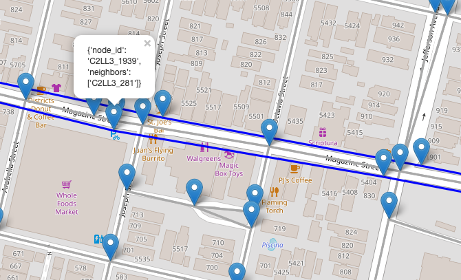
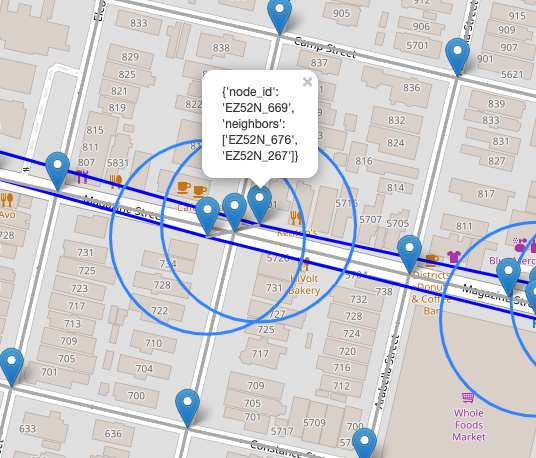

# Discussion - Advanced Python Concepts

## Explore

The first part of my approach to solving the problem was to Explore the data.  

### Visualization

It was challenging to know what the heck is going on with the networks!
I relied on Folium maps to understand what I'm seeing.



The Walking nodes (on the grey lines) and the Transit nodes (on the blue lines) were hard to combine.



It took me a LONG time to actually connect Walking and Transit nodes together.
Building the map definitely helped. Popups show details on who the neighbors of the nodes are.


See modules `final_project.cartography` and `final_project.viz`

## Solve

Next, I needed to dig deep to actually solve the problem of nodes.

### Properties

Properties on the Network class were my first Python syntax innovation, so to speak.  

```python
# final_project.network.Network

    @property
    def nodes(self):
        """Get nodes by calling `Network.nodes`"""
        return self.G.nodes

    @property
    def nodes_df(self):
        """Get the network's nodes as a convenient DataFrame"""
        node_list = [
            {"id": node[0], "y": node[1]["y"], "x": node[1]["x"]}
            for node in list(self.G.nodes(data=True))
        ]
        return pd.DataFrame(node_list)
```

...but making them and their usefulness gave me a lot of confidence.
It might be "just as easy" to do W.G.edges, but remembering that each time is a pain!  

These properties allow us to naturally access information about our Walking network.
Reducing mental load on the user/developer felt like a big win.

### Context Manager

Speaking of reducing cognitive load, this one is probably the win I'm most proud of:

OSMnx heavily relies on looping through nodes of the graph to achieve something.
This feels tedious. As an alternative, I started to develop a Context Manager that allows you
to open the Network's graph as a dataframe and work on it directly.

WIP Alert! This feature is a work in progress. I'm excited about it and want to return.
Rebuilding the graph from the dataframe is actually quite tedious and there are a
lot of edge cases. That said, I feel inspired by context managers. I feel inspired by Advanced Python! Rock on.

```python
with Network().open_as_edges_df() as df:
    df["length"] = ...
```

On close, the dataframe is used to update the graph. This has the benefit of, again,
reducing cognitive load on the developer.


## Refactor

The next step of the journey for me was refactoring and exploring advanced python syntax.

### Descriptor

I wanted a way to compose the functionality of the Network class with mapping functions.

A descriptor felt like a solid choice because it felt like a Network has a map, or mapper.

```python
# final_project.network.Walk**Network
    mapper = NetworkMapper(
        color_by_col="mode", color_scheme={"transit": "blue"}, popup_info=["length"]
    )
```

This feature works in the sense that a map is created with nodes and edges,
but I'm still working on `__get__` vs. `__call__`. I understand that the calling object
can be retrieved via the former, and the latter would allow arguments to be processed.

### Inheritance - Mixin

Also relating to composition, I decided to go with a Mixin for routing functions.

Routing happens directly on a graph and the nodes/edges in it. Therefore it makes sense
that we'd calling something like:

```python
n = Network()
n.get_route_length(route)
```

That said, I felt like the functionality was distinct enough from the Network itself, that
moving the code out of the class felt like it made sense.

### Class methods

I levereaged these to override the default constructor of several classes,
namely WalkNetwork and TransitNetwork.

```python
# final_project.network

class WalkNetwork(Network):
    def __init__(self, graph):
        super().__init__(graph)
        # TODO Enforce schema

    @classmethod
    def load(cls, filepath):
        graph = ox.io.load_graphml(filepath)
        return cls(graph)

    @classmethod
    def create_from_name(cls, place_name):
        graph = ox.graph.graph_from_place(place_name, network_type="walk")
        return cls(graph)
```

## Advanced Python Concepts NOT used

This is possibly a dubious inclusion. But full-disclosure, I wanted to discuss some of the
advanced Python topics I encountered, am aware of, but had to skip for one reason or another,
and have a plan to address.

### Environment
I was very excited to use pipenv. I'm a pipenv convert. And I tried unsuccessfully to install 
osmnx with pipenv. The docs mention this:

```Note: installing the dependencies with pip is nontrivial```

This is true. I tried and failed.  
OSMNX: 1. Filip: 0.

The problem I encountered stemmed from dependency rtree needing to install C-libraries as 
part of install. pipenv installation didn't create the right links. I dug around in the 
conda install routines but ultimately couldn't get rtree to install correctly.

My plan to follow-up on this is to dig deeper into what happens when conda installs c-libraries.

### Is it an application or a library?

Having spent many many days with this project, I think it's an R&D Project with some potentially
useful code that came out of it. That code is starting to come together as library that is
currently WIP.

### Tests + CI/CD
I am saddened and regretful that my library doesn't (yet) have tests, and for that, 
I label this project a WIP.

Honestly, I spent 5+ hours on config alone. Then I spent easily 35-40 hours building map 
views of nodes, and refactoring into desired Python structures.

The process of using Advanced Python syntax for me involved a lot of trial and error and
developer UX work. How do I want to this behave? What would be easy?

I guess you could say that for the scope of the project (was supposed to be 20 hours?),
I prioritized just getting it to work, and playing around with the advanced python syntax.
Do I regret my choices? No, because I plan to add tests later. And I had so much fun with this. 
Seriously.
